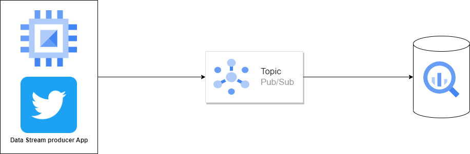

# Real Time Tweet Stream Data Pipeline with Google Cloud Platform

Stream tweet data in real-time, then send the data to Google Pub/Sub into Google BigQuery.

## Architecture



## Requirements

- Twitter dev account
- GCP account with credits
- Terraform
- Google Cloud SDK
- Docker & Docker Compose
- Python 3

## Demo Steps

- Clone this repo.

  ```bash
  git clone https://github.com/etchzel/real-time-tweet-stream.git
  ```

- Change directory to repo directory

  ```bash
  cd real-time-tweet-stream
  ```

- Replace the contents of `gcp_key.json` in `google_credentials` with the contents of your GCP service account file.

- Replace project id, project number, regions, and other configurations in [`variables.tf`](terraform/variables.tf) with configuration settings of your own GCP account.

- Fill in the `.env` file with the relevant data

  ```bash
  TWITTER_BEARER_TOKEN=<your-twitter-dev-bearer-token>
  TWITTER_API_KEY=<your-twitter-dev-api-key>
  TWITTER_API_KEY_SECRET=<your-twitter-api-key-secret>
  GCP_PROJECT_ID=<your-gcp-project-id>
  GCP_PUBSUB_TOPIC=stream-tweet-topic
  GCP_SERVICE_ACCOUNT_PATH=/app/gcp_key.json
  ```

- Modify the terraform configurations if you want to use different topic names and etc. The configurations for pubsub are in [`pubsub.tf`](terraform/pubsub.tf).

- Build image for the data producer

  ```bash
  docker build -f tweet-producer/Dockerfile -t tweet-producer:0.1 .
  ```

- Change directory to terraform, then provision the cloud resources.

  ```bash
  cd terraform
  terraform init
  terraform fmt
  terraform validate
  terraform plan
  terraform apply -auto-approve
  ```

- Run the data producer once the resources are provisioned.

  ```bash
  cd ..
  docker run -d --env-file .env --name tweet-streamers tweet-producer:0.1
  ```
  
- Check the relevant BigQuery table if the data is populated or not. According to the terraform configuration I did, the dataset name should be `test_stream_twitter` and the table name `stream_twitter_to_bq`. For more details check out the file [`bigquery.tf`](/terraform/bigquery.tf).

## Cleanup

- Stop the data producer `tweet-producers` container, and remove the container.

  ```bash
  docker stop tweet-streamers
  docker container prune
  ```

- Type `y` and enter when prompted.

- Take down GCP resources

  ```bash
  cd terraform
  terraform destroy -auto-approve
  ```

## Improvement

- Add front-end interface and back-end service for topic management.
- Add processing step for the data and then visualize in Looker/Data Studio.
- Serve the dashboard through an endpoint.
